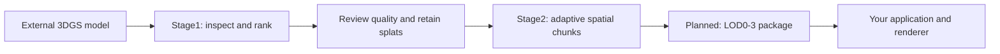

# VR3DGS

**Inspect, simplify and prepare Gaussian splats for real-time applications.**

VR3DGS is a Unity authoring project for reducing 3D Gaussian Splatting models while reviewing the visual tradeoff. Author possible viewpoints, compute a reproducible importance order, and compare retained percentages in the Editor or VR. Its second stage organizes an accepted model into spatial chunks, with per-chunk LOD generation planned next.

The project is being developed as a general-purpose tool. It accepts models from external reconstruction pipelines; [Track3DGS](https://github.com/blacktheon/Track3DGS) is one intended producer. The game or application that consumes the result owns runtime streaming, renderer integration and device budgets.

> **Development status:** Stage1 scoring and review are implemented for the existing SH0 reference workflow. Stage2 currently provides accepted LOD0 data, adaptive chunk ownership and a review scene. LOD1-3 generation, the portable package importer/exporter, and production streaming are planned. The current project includes assumptions from its machine-scene prototype; importing an arbitrary model is not yet a fully automated workflow.

[Quick start](#quick-start) · [Current capabilities](#current-capabilities) · [Input requirements](#input-requirements) · [Architecture](docs/architecture/pipeline-integration.md) · [Package design](docs/contracts/asset-package-v1.md)



## Current capabilities

| Capability | Status |
|---|---|
| Full-source validation, SHA-256 identity and source-row tracking | Implemented |
| CUDA contribution scoring from authored NavMesh viewpoints | Implemented for the current scene profile |
| Importance heatmap and deterministic retained subsets | Implemented |
| Percentage preview without entering Play Mode | Implemented |
| Original/candidate comparison and physical slider review | Implemented in the supplied review scene |
| Authored volume exclusions and orthographic surface baking | Implemented; see the customization guides |
| Compact accepted export with source mapping and baked-surface metadata | Implemented through the worker and existing scene integration |
| Adaptive octree ownership, conservative bounds and Stage2 boxes | Implemented |
| General multi-model import and SH1-3 scoring/review | Planned |
| LOD1-3 generation, mixed-LOD review and refinement | Planned |
| Renderer-independent package handoff and production streaming | Package design proposed; application integration remains separate |

Headset movement recording and the Stage1 **A / Save view** action are temporarily disabled. Their code remains available; Editor surface baking is separate and remains available. Stage2 A toggles chunk boxes. Do not assume Stage2 B or pointer-based quality marking is implemented yet.

## Requirements

The currently supported authoring setup is **Windows with an NVIDIA CUDA GPU**. CPU source inspection remains available without a working CUDA backend once the worker is installed.

| Component | Project configuration |
|---|---|
| Unity | **6000.3.19f1**, as recorded in `ProjectSettings/ProjectVersion.txt` |
| Render pipeline | URP **17.3.0** |
| Unity splat renderer | Embedded `wu.yize.gsplat` **1.4.0**, with local Stage1 patches |
| XR integration | Meta XR SDK **205.0.0** and OpenXR **1.17.0** |
| Worker | Isolated Python **3.11.16**, PyTorch **2.7.1+cu128**, pinned gsplat source |
| Native build tools | Visual Studio **2022 C++ Build Tools** and CUDA Toolkit **12.8** |

The current worker locates VS Build Tools and CUDA at their standard Windows installation paths. A Python launcher (`py.exe`) or `python.exe` with pip, Git, and internet access are needed to bootstrap dependencies. The setup script creates its environment under `Tools/SplatWorker`; it does not install the NVIDIA driver, CUDA Toolkit or Visual Studio for you.

Desktop reference rendering uses Direct3D12. The local renderer patches and render-feature configuration are part of the reference workflow; replacing the embedded package with an unmodified upstream release can remove required functionality. See [renderer patch notes](Packages/wu.yize.gsplat/STAGE1_PATCHES.md).

## Quick start

### 1. Open the Unity project

```powershell
git clone https://github.com/blacktheon/VR3DGS.git
```

Add the cloned repository root to Unity Hub and open it with the recorded Editor version. This root contains `Assets`, `Packages`, `ProjectSettings` and this README. Allow Unity to resolve packages and compile scripts.

Large source models, baked textures, result sets and the Python environment are excluded from Git. The supplied `Stage1` and `Stage2` scenes may therefore have missing local assets in a fresh checkout. Restore an existing author's generated data if reproducing that exact example, preserving its `.meta` files. A successful clone alone does not include the machine dataset or an accepted ranking.

### 2. Set up the local worker

Open **Tools → Splats → Stage 1 Preprocessor → Setup**:

1. Select **Install / repair worker dependencies** and wait for completion.
2. Select **Check GPU environment**. The first native compilation can take several minutes.
3. Select **Check Unity rendering setup**.

Setup progress and failures are logged in `SplatData/setup/setup.log`. Processing jobs have separate logs under `SplatData/jobs/<job-id>/`.

### 3. Inspect your source

Choose the original PLY and select **Inspect full source**. Inspection checks every row and records its identity; invalid values are reported rather than silently removed.

Inspection supports the PLY profile described below, including SH0-3. **The current end-to-end scoring scene requires SH0.** Inspecting an SH3 file does not mean that the current Unity scoring path can process it. Preserve the original file when preparing a compatible reference; the proposed generic workflow will keep higher-order colour data.

For the existing reference workflow, import a byte-identical source copy into Unity with **Uncompressed**, **RUB** coordinates and **opacity pruning = 0**. The saved active scene must contain exactly one assigned source `GsplatRenderer`, one authored `Walls` group with its `Floor` plane, a nonempty baked NavMesh, and one camera named `CenterEyeAnchor`. This is a developer-assisted scene preparation step today, not an arbitrary-model import wizard.

### 4. Score and inspect the result

Save the configured scene, then use the **Process** tab to **Capture immutable scene snapshot** and **Score scene and run first-round verification**. Scoring produces a frozen rank plus independent comparison views and a report.

In **Review**, choose **Select latest completed ranking**, then **Load selected ranking into review**. Under **Edit Mode preview**, change **Keep splats (%)** to update the model without running the game. **Show original (100%)** compares against the eligible baseline while retaining the candidate percentage.

In the supplied Play Mode review scene, **Slider No Snapping** controls retention and **right B** switches the eligible original/candidate. The physical handle position controls the initial Play Mode value; the Edit Mode slider does not reposition that handle. Headset/controller operation depends on your XR setup.

The percentage is relative to the eligible set after authored exclusions. It is not necessarily the same percentage of the original PLY. Lowering the preview percentage reduces selected rendering work; source buffers remain resident. A compact accepted export is required to reduce the stored source representation.

### 5. Prepare the accepted model for Stage2

The current **Export** tab is informational. Accepted export and chunk generation exist as worker commands, documented in the [Stage2 foundation handoff](docs/stage2-foundation-handoff.md#next-milestone). Those commands require matching source, rank and presentation manifests; use a new output directory for each version.

Once an accepted input and chunk layout exist, open **Tools → Splat LOD Builder**, select their manifests and choose **Build / Update Stage2 Scene**. Review the accepted LOD0 and toggle the red chunk boxes. This currently verifies organization and ownership; it does not create LOD1-3 or enable per-chunk runtime culling.

## Input requirements

The source inspector currently accepts **binary little-endian PLY 1.0** with one vertex element and scalar float32 properties. Required fields are:

```text
x y z
rot_0 rot_1 rot_2 rot_3
scale_0 scale_1 scale_2
opacity
f_dc_0 f_dc_1 f_dc_2
```

Rotations use `wxyz` quaternions, scales use the standard 3DGS logarithmic representation, and opacity is stored as a logit. Complete, contiguous `f_rest_*` sets represent SH1, SH2 or SH3. Source inspection is stricter than the renderer's general import capabilities: SPZ, compressed PLY and arbitrary point-cloud PLY files are not interchangeable with this reference input.

Coordinates and physical scale must be checked before authoring viewpoints. Current machine-scene values are user-authored Unity units; they are not an independently measured calibration. A general model should not inherit that scene's floor-clipping or viewpoint-height rules.

## Files and reproducibility

```text
Assets/SplatPreprocess/        Stage1 Editor tools, review controls and tests
Assets/SplatLOD/               Stage2 scene and chunk foundation
Packages/wu.yize.gsplat/       Pinned renderer with local selection/wall patches
Tools/SplatWorker/             Python/CUDA worker and tests
docs/                         Workflows, implementation notes and designs
SplatData/                     Local sources, jobs, ranks, reports and exports (ignored)
```

Results retain source hashes, original-row mapping, processing settings and coordinate information. New work should produce a new result version. Keep the original PLY and the local result folder if you need to reproduce an accepted selection. Changing source identity or eligibility geometry can invalidate a ranking; a NavMesh-only change may permit frozen preview while requiring new scoring for updated viewpoint coverage.

For application handoff, the proposed [asset package v1](docs/contracts/asset-package-v1.md) uses PLY data, JSON manifests, stable provenance and optional visual meshes/textures. It avoids dependencies on another repository's absolute paths, Unity GUIDs or Python environment. **This portable contract is a design target, not the current export format.**

## Development and troubleshooting

Run the worker tests from `Tools/SplatWorker` after installing dependencies:

```powershell
& .\.venv\Scripts\python.exe -m pytest -q
```

Run Unity EditMode tests using **Window → General → Test Runner**, including the `SplatPreprocess.EditMode.Tests` assembly. These checks do not replace headset or Android performance testing.

| Symptom | Check |
|---|---|
| Demo scene has missing models or textures | Restore local generated assets; they are not included in Git |
| CUDA setup or compilation fails | `SplatData/setup/setup.log`, required toolchain paths, then **Check GPU environment** |
| Model is missing in Game view | The active camera's URP renderer needs the Gsplat feature; verify the graphics API |
| Percentage control cannot load a result | Check the completed rank, source identity and scene validation message |
| Game preview still shows 100% | Disable **Show original (100%)** / return to candidate mode |
| A does nothing in Stage1 | Save-view capture is intentionally paused |
| Stage2 has boxes but no LOD switching | Only the LOD0 foundation is implemented |

## Documentation

- [System responsibilities and handoffs](docs/architecture/pipeline-integration.md)
- [Portable asset package v1 — proposed contract](docs/contracts/asset-package-v1.md)
- [Stage1 scoring and review](docs/stage1-round1-handoff.md)
- [Volume deletion and surface baking](docs/stage1-surface-customization.md)
- [Top surface and additional volume removal](docs/stage1-top-and-cube3.md)
- [Stage2 implemented foundation](docs/stage2-foundation-handoff.md)
- [Renderer integration comparison](docs/stage1-renderer-comparison.md)

The handoff documents preserve milestone-specific measurements and examples; their historical counts are not general quality guarantees or standalone Quest budgets. Review the current code and the status table above when distinguishing available functionality from future work.

## Credits and licensing

VR3DGS builds on [gsplat-unity](https://github.com/wuyize25/gsplat-unity), [gsplat](https://github.com/nerfstudio-project/gsplat), Unity and the XR packages recorded in the package manifest. See the [worker notices](Tools/SplatWorker/THIRD_PARTY_NOTICES.md), [renderer licence](Packages/wu.yize.gsplat/LICENSE.md) and bundled third-party notices.

The repository currently has no root project licence. Third-party licences describe their respective components; they do not establish a licence for all original project code or bundled sample content.
