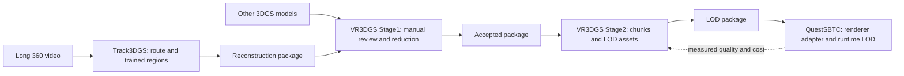

# Two authoring projects, one application consumer

Status: Proposed system design, 2026-09-29. This document records the requested repository boundaries and interfaces. It does not claim that the new route pipeline, generic package adapters or lower LODs are implemented.

## 1. Ownership

| System | Repository / workspace | Owns | Does not own |
|---|---|---|---|
| Track3DGS | [blacktheon/Track3DGS](https://github.com/blacktheon/Track3DGS), `C:/Work/Unity/DSTA/Track3DGS` | Step 1: video to shared route coordinates. Step 2: regional training, cleanup, overlap assembly and seam verification | General manual model editing, runtime LOD policy, multiplayer |
| VR3DGS | [blacktheon/VR3DGS](https://github.com/blacktheon/VR3DGS), `C:/Work/Unity/VR3DGS/VR3DGS` | Step 3: generic Stage1 authoring/reduction/review. Step 4: spatial partitioning and offline LOD generation | Mandatory video reconstruction, tank logic, game deployment |
| QuestSBTC | `C:/Work/Unity/DSTA/QuestSBTC` | Step 5: package import, renderer adapter, local camera selection, loading, LOD transitions and standalone profiling | Source training and destructive edits to the authoring masters |

There are two reusable authoring projects. QuestSBTC is their first game consumer, not a third preprocessing tool. The two authoring projects exchange versioned data; neither imports source code, Python environments, Unity scene GUIDs or absolute working paths from the other.



The [asset package v1 specification](../contracts/asset-package-v1.md) is the detailed input/output contract. It defines PLY encoding, JSON manifests, coordinates, SH appearance, provenance, presentation meshes, versioning and validation. The contract and this overview are mirrored identically in Track3DGS for local planning; VR3DGS owns the canonical copies.

## 2. Design constraints from the actual game

Driver, commander and gunner are separate players. Each client renders the local player's active periscope cameras. Periscopes rotate with fixed zoom. Tank heading and movement within the authored drivable area are unrestricted. A capture trajectory therefore cannot be treated as the only allowed camera path or viewing direction.

Offline pruning preserves the union of supported positions, vehicle headings, camera offsets and periscope angles. Runtime visibility/LOD handles the much smaller view active on a particular device. Permanently deleting geometry outside one momentary frustum would break later turns.

The first reconstruction input supplies video only. Use one explicit approximate scale and level for the route, preserve reconstructed slopes/turns, and report drift or weak coverage. A 150-second clip does not establish one kilometre. A single capture pass also cannot reveal every surface visible from an arbitrary driving position; inspect the authored NavMesh against actual reconstruction coverage.

## 3. Step 1: continuous route reconstruction in Track3DGS

### Inputs

- A continuous, stitched equirectangular video supported by FFmpeg; the initial path targets the existing 8K/30 fps body-locked export workflow.
- Existing vehicle mask, sky-mask prior and mount-calibration files when they match the capture. The mask assumes the vehicle remains in a consistent image location; a differently stabilized export requires validation.
- A versioned `route_config.json` describing source path, selection settings, calibration basis, software locations, region settings and output root. Local input paths are allowed here; they never become mandatory paths in an exported package.

Keep the tested best-of-three sharpness selection, eight yaws `[-135,-90,-45,0,45,90,135,180]`, 1600-square perspective views, 100-degree FOV, vehicle/sky union masks and COLMAP global mapper as initial defaults. Preserve the incremental mapper as a fallback. Do not switch trainers, masks, image resolution or dependency versions as an incidental part of this redesign.

The route mode extracts once and carries original frame indices/timestamps through all crop/region selections. For variable-rate input, preserve decoded presentation timestamps rather than inventing them from average FPS. Process in bounded batches so a long video does not require every decoded frame to be resident or temporarily written at once.

Solve a connected route reconstruction before regional training. Use shared observations across region boundaries. Keep disconnected components visible in diagnostics; the legacy largest-component selection must not silently discard an internal part of the requested route. Start with the installed global mapper and measured resource use. Hierarchical/windowed SfM with shared IDs and joint alignment is a fallback when the full route cannot be solved within available resources, not a prerequisite rewrite.

Apply one global scale and orientation. Keep mount-calibration lessons, but do not use the old per-section origin/heading reset independently for every future cell. Do not infer absolute gravity by forcing a vehicle camera travelling on a slope to be level. A user-adjusted approximate route frame is acceptable and must be identified as such.

### Outputs and gate

Internal outputs: original-timestamp frame records, masks/views, connected COLMAP data, `route.json`, calibrated camera records, source/config hashes and top-down/elevation/registration reports. These are resumable working data; the final portable output is published after step 2.

Before training: inspect bends, height changes, coverage gaps, coordinate scale and frame consistency. A connected reconstruction alone does not establish survey accuracy. Split changes and calibration changes create new dependent versions.

## 4. Step 2: bounded training and coherent assembly in Track3DGS

The new route profile initially proposes 100 nominal-metre cores and 20 nominal-metre context on either side. The existing section workflow retains its defaults. Core ownership and observation overlap are different concepts: cameras/context may overlap, while final content has a unique owner.

Keep Splatfacto, masked loss, existing iteration defaults, pose-normalization disabling, export-alignment guards and the tested sky/glitter/needle cleanup rules. Region-specific camera selection limits memory. Train all planned regions sequentially on the current GPU, with independently resumable checkpoints. The orchestrator must not call the destructive legacy section wrapper and must not retain its fixed `cell 0` assumption.

SH3 appearance and geometry must share a declared frame. The current export correction checks geometry but does not by itself prove directional-colour correctness. The new package path preserves native PLY attributes and records a transform; cleanup and QC use transformed positions/directions without silently baking an incomplete SH conversion. Existing legacy output remains a separate compatibility path.

Assemble exported subsets using deterministic ownership. Preserve full training outputs and removal provenance. On ordinary route stretches, ownership can use continuous projection onto the polyline and half-open core ranges; detect nearby nonadjacent branches and require an explicit spatial override or shared region where the assignment is ambiguous. Never resolve duplicate content by deleting all Gaussians within a proximity radius.

No region may export content owned by another region. Gaussian footprints may extend across ownership boundaries. Validate final assembled appearance using surrounding context: both travel directions, candidate lateral offsets, varied headings and periscope views. An ownership audit cannot prove an invisible seam.

Repair failures using the least invasive change: correct alignment/exposure, expand observations and retrain affected regions, or train a shared boundary region and validate its new joins. A more advanced joint refinement backend is a separate measured improvement; it must not silently replace the production trainer. A failed boundary remains `review_required`, and no automatic claim of seamless output is allowed.

For recording endpoints, use extra capture coverage or mark unsupported ends nonplayable. For the first route, prove three adjoining regions before training everything. The target deliverable is a `kind: reconstruction` package containing cleaned, uniquely owned PLYs, transforms/provenance, route/camera metadata and seam reports.

Existing edited PLYs remain immutable reuse candidates. Matching old source observations/poses can recover placement; arbitrary crops or locally distorted reconstructions may require regeneration. Legacy registration is an optional migration task after the new baseline works, not a requirement to discard manual work.

## 5. Step 3: general Stage1 authoring in VR3DGS

Input is a reconstruction package or a supported standalone PLY. Import adapters establish coordinates, source identity, calibration and appearance before authoring. Route metadata supplies useful hints; it is never mandatory for object scans or unrelated scenes.

Move scene-specific assumptions behind explicit profiles. Generic components describe allowed positions, camera rigs, orientation limits, optional exclusion volumes and optional visual replacements. A tank/periscope profile composes vehicle position/heading with external camera offsets. A walkable object profile can use pedestrian heights. Neither requires a game repository or hardcoded names such as `ScottVickers`, `Walls/Floor` or `machine`.

The user may author a NavMesh and edit volumes manually. Floor clipping is optional; sloping terrain must not be removed beneath one global plane. Support the input's declared SH degree through import, scoring, reference rendering and export. Keep the existing SH0 workflow operational while adding higher-order fixtures.

Reuse source hashing, full-row audits, contribution scoring, frozen ranks, heatmap, Edit Mode percentage preview, original/candidate comparison, physical slider integration, worker job recovery and compact original-row export. Lowering a review slider does not imply smaller resident source buffers; export the accepted subset before measuring storage savings.

Score with neighboring assets present. Keep independent verification cameras and exact retained/excluded counts. VR review remains the user's quality decision. Continuous headset movement recording and A-button view capture stay deferred; they are not necessary for authored/offline view generation.

Output is a `kind: accepted` package: retained splat records, source mapping, rank/view/calibration provenance, exact count denominators, acceptance record and any required baked visual surfaces. Original photos are optional refinement evidence. The accepted model is the Stage2 appearance reference.

## 6. Step 4: general spatial partitioning and offline LOD in VR3DGS

Reuse the existing adaptive octree ownership code, separate partition/render bounds and immutable LOD0 representation. Replace machine-specific settings with explicit configurable parameters and use occupancy, physical size and measured visual complexity to choose subdivision. Training regions do not define the runtime layout.

LOD0 preserves the accepted Stage1 model. LOD1-3 use the existing design direction of compatible Gaussian merging with image-based refinement; simple importance pruning remains a comparison baseline. Different chunks can need different counts for comparable image quality. Target ratios are experiments, not guaranteed thresholds.

Verify all-LOD0 equivalence, each uniform level and mixed neighboring levels using the intended cameras. Record actual counts, visual error, original/derived identity and unresolved defects. Require correct sorting across active chunks for each camera. Preserve optional replacement surfaces in the same coordinate frame.

Output is a `kind: lod` package. It contains chunk IDs, independent level assets, conservative bounds, transform/SH/colour metadata, quality profiles and accepted-source provenance. It deliberately contains no fixed Quest renderer, native GPU buffer layout, universal distance thresholds or multiplayer code. Any consumer can implement a compatible adapter.

Current status: Stage2's LOD0/chunk foundation exists; lower levels, generic package handling and refinement remain implementation work. The root README distinguishes these states.

## 7. Step 5: game integration and device budgets in QuestSBTC

Validate the LOD package and build renderer-specific assets in a disposable cache. Select the renderer/compression profile later through actual standalone measurements. The package's source data remains usable after a plugin change.

The application selects visible chunks and levels for each local player's active periscopes. Use projected detail in the render target, FOV, conservative visibility, available memory and measured cost. If multiple local scopes are visible simultaneously, satisfy their combined needs. Camera-specific sorting work remains correct even when source buffers are shared.

Implement asynchronous load/unload, request cancellation, fallback representations, hysteresis and prefetch for driving and rotating views. A fixed nearest-three-region toggle is not a production streaming policy. Retain coarse distant scenery when visible and budget stored, resident, selected and rendered splats separately.

Before expensive full-route processing, test that the chosen renderer works with periscope render textures on standalone Quest 3. The handover's `Instruments_NoSplat` workaround excludes splats from those cameras; the existing `GSLODManager` only toggles nearest renderers. Neither establishes the required runtime path.

Pressure tests include driving/reversing, rapidly rotating tank and scopes, long sightlines, dense foliage, region boundaries, loading peaks and sustained thermal operation. Use 72 Hz as the initial test profile unless the game chooses another target; its roughly 13.9 ms frame budget includes the entire simulator. Return a revision-linked runtime report to guide offline quality/count changes.

## 8. Handoff responsibilities and failure behavior

| Handoff | Producer validates | Consumer validates |
|---|---|---|
| Video to route | Timestamp identity, registered coverage, coordinate consistency, approximate calibration status | Region planner checks coverage and declared units |
| Route to regions | Core/context assignment, fixed shared poses, complete region list | Trainer checks compatible calibration/settings and available observations |
| Reconstruction package to Stage1 | Cleaned-source identity, unique ownership, seam status, portable files | File hashes/counts, codecs/SH, transforms, appearance fixtures and limitations |
| Accepted package to Stage2 | Exact selection, exclusions, immutable reference, visual surfaces | Reassembled LOD0 equivalence and complete ownership |
| LOD package to game | Level counts/bounds, mixed-level quality, source/layout revision | Adapter conformance, periscope rendering and device profile |

Publish accepted outputs only after required checks and recorded review. Failed stages retain logs and valid predecessors; they do not overwrite accepted packages. Unknown codecs/versions/capabilities, missing required surfaces, altered files and unsupported transforms fail clearly. Missing optional route or photographic evidence disables only the corresponding optional operation.

External editing creates a new source revision. Never reuse a frozen rank or original-row identity after an untracked reorder/change. Feedback refers to exact package and layout revisions so a quality mark cannot silently point to a different chunk after repartitioning.

## 9. Delivery order

1. Establish the interchange contract and synthetic conformance fixtures.
2. Extend Track3DGS for one shared route and resumable region training; prove three neighboring cells and assembly.
3. Extend VR3DGS's generic import/view profiles and preserve higher-order appearance; retain the current manual review workflow.
4. Complete adaptive LOD generation and portable export in VR3DGS.
5. Integrate the measured renderer/streaming adapter in QuestSBTC and pressure-test the accepted package.

An early standalone rendering compatibility test can run alongside authoring development. It does not move runtime ownership into either authoring repository.

The requested first implementation plan covers Track3DGS steps 1-2 only: [Track3DGS plan](https://github.com/blacktheon/Track3DGS/blob/master/docs/superpowers/plans/2026-09-29-route-reconstruction-and-regions.md). VR3DGS generalization/LOD and QuestSBTC runtime each receive their own later implementation plan.

## 10. Initial Track3DGS route profile

These values define a reproducible starting experiment, not universal quality or performance limits:

| Setting | Initial route-mode value |
|---|---|
| Sharpness group | 3 source frames |
| Perspective views | 8 yaws listed in section 3; 1600 by 1600 pixels; 100 degrees |
| SfM | Installed COLMAP 4.1.1 `global_mapper`; sequential overlap 48 |
| Training | Existing Splatfacto recipe; 30,000 iterations; one GPU job at a time |
| Photographic verification | Every tenth selected source frame held out from Gaussian training, all its crops together; poses may still use it |
| Region core/context | 100 / 20 nominal metres |
| Playable margins | Initially 20 nominal metres at each recording end; configurable after coverage review |
| Boundary retry | At most two automatic context-expansion retries, adding 10 nominal metres each time; unresolved joins require review |
| Scale | Explicit `nominal_speed`, `manual` or `unscaled` mode; no implicit known real distance |

`nominal_speed` requires a positive `speed_kmh` and sets approximate scale. `manual` requires a positive `meters_per_sfm_unit` and a declared approximate/calibrated basis. `unscaled` requires region lengths, margins and physical filter thresholds explicitly supplied in scene units; metre-valued defaults must not silently apply. Approximate calibration uncertainty is retained downstream. Stop if the chosen margins leave no playable interval.

The first test keeps current dependency environments separate: Track3DGS's utility environment and its Python 3.11 training environment remain distinct from VR3DGS's Python/CUDA worker. Preserve the working Nerfstudio 1.1.5 / gsplat 1.4.0 / PyTorch 2.7.1+cu128 training environment and audit the existing large-image-cache patch; do not upgrade it as part of this plan.

The following proposed `pipeline/examples/route_config.example.json` illustrates the local input format. Paths resolve relative to that config file. The 10 km/h value is an explicit illustrative assumption, not a measurement; the source path and calibration must be checked for the actual recording. This interface is not implemented yet.

```json
{
  "schema_version": 1,
  "route_id": "route-test",
  "revision": "r001",
  "source_video": "../../data/raw/route-test.mp4",
  "workspace": "../../data/routes/route-test/r001",
  "vehicle_mask": "../../data/raw/track01_vehicle_mask.png",
  "sky_prior": "../../data/raw/track01_sky_prior.png",
  "mount_calibration": "../mount_calibration.json",
  "capture": {
    "sharpness_group": 3,
    "view_size": 1600,
    "fov_degrees": 100,
    "yaws": [-135, -90, -45, 0, 45, 90, 135, 180]
  },
  "scale": {
    "method": "nominal_speed",
    "speed_kmh": 10,
    "status": "approximate"
  },
  "reconstruction": {
    "mapper": "glomap",
    "overlap": 48
  },
  "regions": {
    "core_length": 100,
    "context_length": 20,
    "start_margin": 20,
    "end_margin": 20
  },
  "training": {
    "backend": "splatfacto",
    "iterations": 30000,
    "max_active_jobs": 1,
    "holdout_stride": 10
  },
  "toolchain": {
    "utility_python": "../../.venv/Scripts/python.exe",
    "training_python": "../../.venv-train/Scripts/python.exe",
    "colmap": "C:/Work/tools/colmap/bin/colmap.exe"
  }
}
```

`mapper: glomap` retains the existing CLI vocabulary and invokes COLMAP's built-in `global_mapper`; it does not select a separate GLOMAP executable. A route-wide transform selected during coordinate review is persisted with the route version, never independently inferred again for each region.
